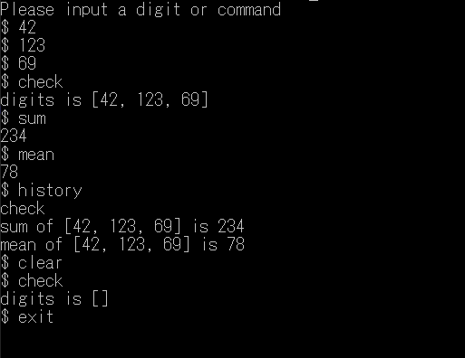

# misc-calculator
This application does miscellaneous calculations.

## How to use
### 1. Launch
- `python misc_calculator.py`

### 2. Enter a digit or command
- When you enter a digit, the application stores it.
- When you enter a command, the application processes the stored digits.
- Supported commands are as follows:

  - Calculation commands
      |command|description|
      | ---- | ---- |
      |sum, total|Calculates sum of digits|
      |mean, average, avg|Calculates mean of digits|
      |median, med|Calculates median of digits|
      |max|Calculates max of digits|
      |min|Calculates min of digits|
      |count, cnt, length, len|Calculates count of digits|

  - Other commands
      |command|description|
      | ---- | ---- |
      |check, check-digits, digits|Prints digits|
      |clear, clr, reset, rst|Clears digits|
      |help, h|Prints help text|
      |history, hist|Prints history|

  - Exit commands
      |command|description|
      | ---- | ---- |
      |end, stop, exit, bye|Exits this application|

### Usage image
  
